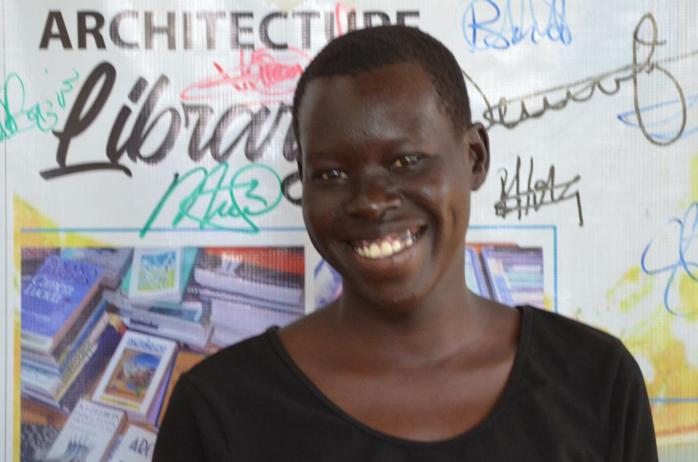

# Current status 
The current status here will involve all the new developments and changes taking place at [PAGarchilib](https://github.com/WeAreYEF/PAGarchLibrary),reader's profiles,their book of interests,and their targets for knowledge search.
# development
We were able to develop a **moveable bookshelf** which can handle storage of all our library resources,we could do it ourselves at the space but due to **lack of equipments**,we made it in adjumani town with the help of professionals in the field of **carpentry**.

# reader's profiles and others
# 1.Wafela Andrew (chardso)

- GitHub participant

- Hardware expert

- lead expert

- open hardware makers (participant)

- member of **ASKnet**

- member of **GIG** (Global Innovation Gathering)

- Currently volunteering at The Youth Empowerment Foundation **(YEF)** in GitHub documentation.

I am a frequent reader,at [PAGarchlib](https://github.com/WeAreYEF/PAGarchLibrary),the space has alot of innovative books but at the moment I prefer concentrating on one ,which is **introduction to telecommunications and electronics**,reason being I am participating in an **open hardware maker** and I have a modular radio project of which they are mentoring me on.So my favorite book for now is .It helping research and note basics of modulation,here is the link to my project>>>[Modulor radio project](https://github.com/chardso/building-an-fm-radio-transmitter)

I would like to extend my great thanks to **r0g** (Agency for open culture and critical transformation) on behalf of **YEF**(The Youth Empowerment Foundation) for lobbying funds for this kind of innitiative, it's an initiative which will benefit generation after generation,applauds to **Mr Steven kovarts** and the friends who supported the idea and all those who are yet to add in the support.Not forgetting my great community Access to skills and knowledge network **(#ASKnet)** which is the supporting partner,which entrusted The Youth Empowerment Foundation **(YEF)** to implement this wonderful innitiative."long live the three giant partners,**r0g**,**ASKnet** and **YEF**".

# 2.Abio Kevin

## Camp
*Pagirinya refugee camp*
## Block
*D*
## Education
*Senior three (3)*
## School
*Pagirinya secondary school*
## Tel:.**+256760057160**
She is a first time reader, learnt how to build without burnt bricks (ramped earth tech) and got inspired to work hard and become an architectural engineer,she discovered from [PAGarchilib](https://github.com/WeAreYEF/PAGarchLibrary) that women can also architectural positions,an inspiration from the author of African style  **Ed Angelika Taschen**
# 3.Moses Eli

## Camp
*Pagirinya refugee camp*
## Block
*C*
## Education
*Senior three (3)*
## School
*Pagirinya secondary school*
## Tel:.**+256773747132**
He is a regular reader at [PAGarchlib](https://github.com/WeAreYEF/PAGarchLibrary),"The books inspire us alot,on how to build beautiful houses for staying and also for public use like halls and classrooms"."My favorite book is that of **Francis kere, RADICALLY SIMPLE"** 
# 4.Baako Scovia

## Camp
*Pagirinya refugee camp*
## Block
- 
## Education
*Senior four (4) leaver*
## School
*Pagirinya secondary school*

## Tel:.

She the current library attendant for [PAGarchlib](https://github.com/WeAreYEF/PAGarchLibrary) .For more details about her, open the link >>> [PAGarchlib attendant](https://github.com/WeAreYEF/PAGarchLibrary/blob/main/Introduction-of-the-librarian.md)
# 5.Innocent Gama

## Camp
*Pagirinya refugee camp*
## Block
*D*
## Education
*Senior three (3)*
## School
*Pagirinya secondary school*
## Tell:.**+256760206291**
Like his friend Opira Jonathan,he is also an artist and aregular reader at [PAGarchlib](https://github.com/WeAreYEF/PAGarchLibrary),besides participating in the sketching of how other designs and flowers can be applied to improve the satelite space.He also attends to the peer to peer learning of the basic computer skills.
# 6. maridio Janet

## Camp 
*pagirinya refugee camp*
## Block
*B*
## Education
*Senior four (4)* 
## School 
*pagirinya secondary school*
## Tel:. **+256760166326**
She is a student leader at pagirinya secondary school,so excited having the opportunity to access [PAGarchlib](https://github.com/WeAreYEF/PAGarchLibrary) where she got courage to dismiss the believe that architecture is only for boy's that what boys can do, girls can also do, "However Maridio also lamented that the resource is going to accelerate access to knowledge for the young people of her age instead of staying iddle".She also tasked herself as a student leader to sensitize other students especially her fellow girls to join her at the space to utilize the resource,other than staying iddle.She applauded The Youth Empowerment Foundation **(YEF)** for such a great opportunity and urged them give them a chance to peer to peer basic computer skills on weekends for them to be able to apply the knowledge acquired in a digital way since the world of today is all about computer.much 💕 **YEF**.
 
# 7.Opira Jonathan

## Camp
*Pagirinya refugee camp*
## Block
*B*
## Education
*Senior four(4) leaver*
## School
*Pagirinya secondary school*
## Tell:.**+256785609501**
He is a design artist,the occupation he resumed after his senior four due to lack of funding to further his studies,but since he was good in fine art ,he resorted to applying the skills obtained from school in fine art lessons,He is greatful for the opportunity brought by The Youth Empowerment Foundation **(YEF)**,as the resource is well equiped with the books 📚 of his field of interest."I am also requesting for peer to peer computer training lessons to go hand in hand with the utilization of the library resources,big up's **YEF**.

# 8.Tarapkwe Concy

## Camp
*Pagirinya refugee camp*
## Block
*D*
## Education
*Senior two (2)*
## School
*Pagirinya secondary school*
## Tell:. **+256770600173**
She is a first time reader:"I enjoy the place so much,the books are many but the ones I read,I really like them.i have learnt to decorate and I have joined the artists to put our imaginations into drawing,I would also love 💕 to join the peer to peer computer training lessons on weekends".

