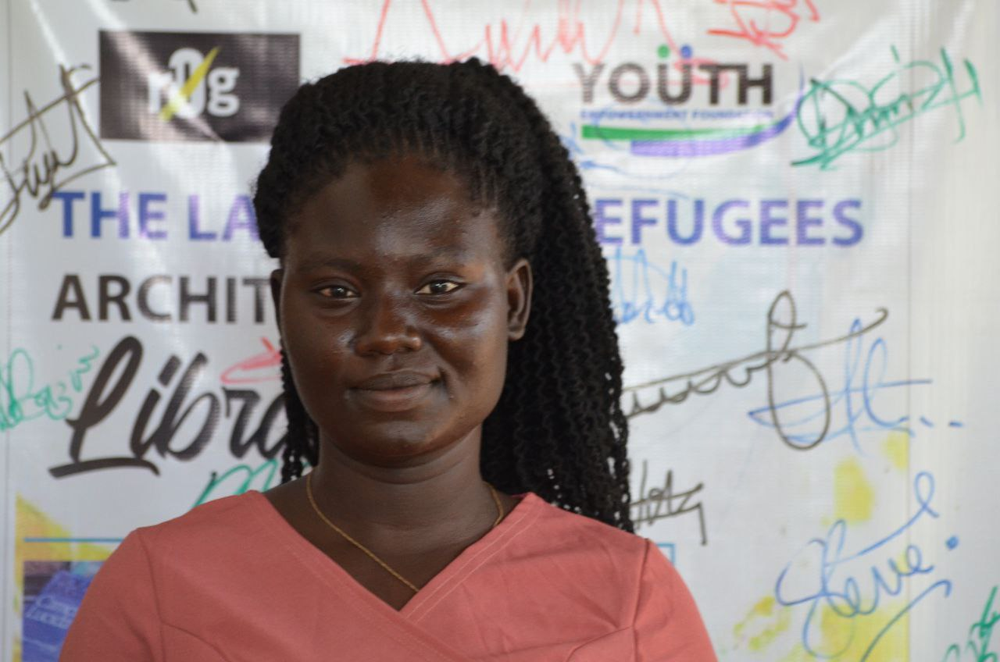
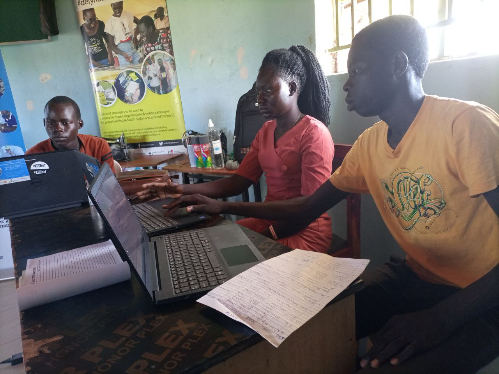

# Baako scovia
Ms.baako scovia is at the age of 23yrs,a south sudanese refugee in pagirinya Uganda,aformer student of pagirinya school where she attained her ordinary level certificate of secondary education.

Like most of the refugees, students who lack financial support to further her studies,she decided to engage in volunteering as a primary school teacher.

When she discovered about **The Youth Empowerment Foundation** (**YEF**) and it's activities at the settlement,Baako got interested and applied to serve as a librarian when **YEF** was looking for one.

*Photo credit*:**IRA Emmanuel**

She is discovering alot of new things at pagirinya satelite space especially the architecture library,she is also undertaking basic computer training through peer to peer learning.

Baako wants to inspire other refugee girls to discover themselves and join the **open peer to peer learning process** at **YEF** and most importantly take the advantage of the library to learn and share ideas in **art**, **architecture**, **photography** and **technology**.
