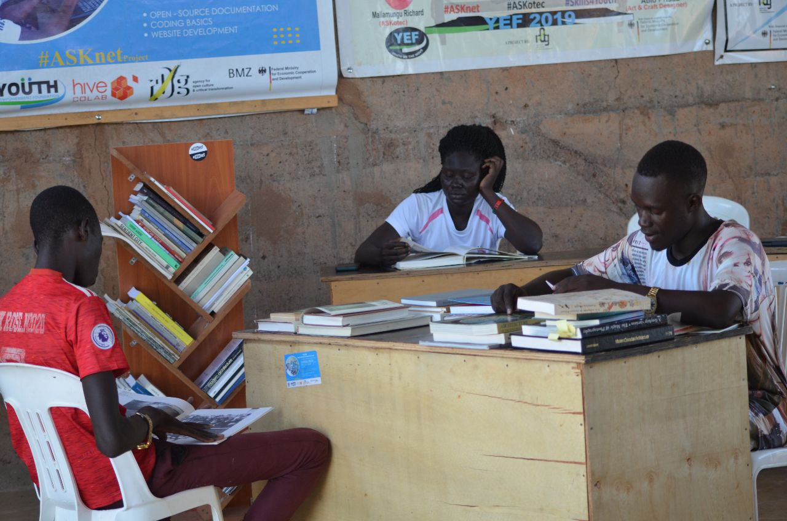
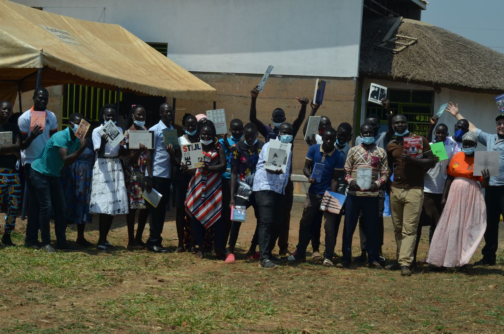

# PAGarchLibrary - Pagirinya Architecture Library
## PAG - stands for pagirinya
*Pagirinya* is a refugee camp in eastern adjumani district in northern Uganda.
## arch - stands for architecture
*architecture* is the art and technique of designing and building as distiquished from the skills associated with construction.

*library* - is a collection of resources in avarriety of formats.but for this case we are looking at the architectural format.

*Architecture library* is a learning lab for mult-disciplinary study of the built environment, providing hybrid collections of prints and digital materials
# objectives
- To provide adequate studies towards establishing an architecture that will shelter and cater for the needs of the internally displaced people,in this case the youths are trained with the resource on how to solve architectural problems in the local ways using the available resources.

- To also provide a resource for architects with in and outside the camp to research and improve on their architectural knowledge.
- To reflect on stories about architecture and design of refugee camps, including urban designs,shelters,toilets and opinions about designs for the aid of camps.
# launch of PAGarchLibrary

                  **Photo credit:Allan amanyara**

The library was launched on **19th/Feb/2022** at The Youth Empowerment Foundation (YEF),attended by over **50**people.
The diginitories present at the launch were the representative from UNHCR Mr vitali,the representative from R0g ,Mr Steven kovarts,local representatives,the RWC2 pagirinya refugee settlement,Mr obulejo martin, political leaders,the chairman LC3 dzapi subcounty,The DPC, pagirinya police station and students of pagirinya secondary school.
## Partners

| r0g Agency | ASKnet  | YEF |
| :--------: | :----: | :-------: |
|||   |
| [Official Website](https://openculture.agency/) | [Official Website](https://github.com/ASKnet-Open-Training) | [Official Website](https://yef-uganda.org/) |
