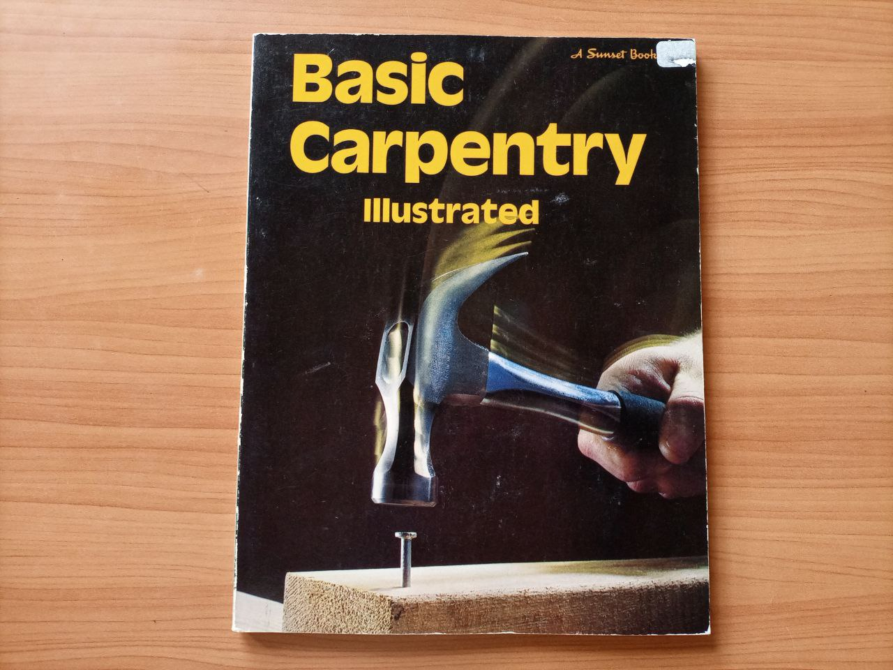
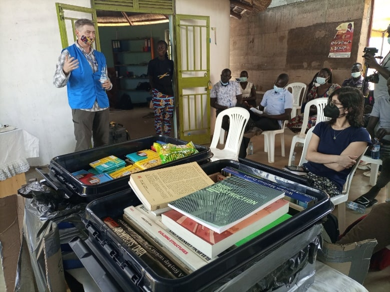
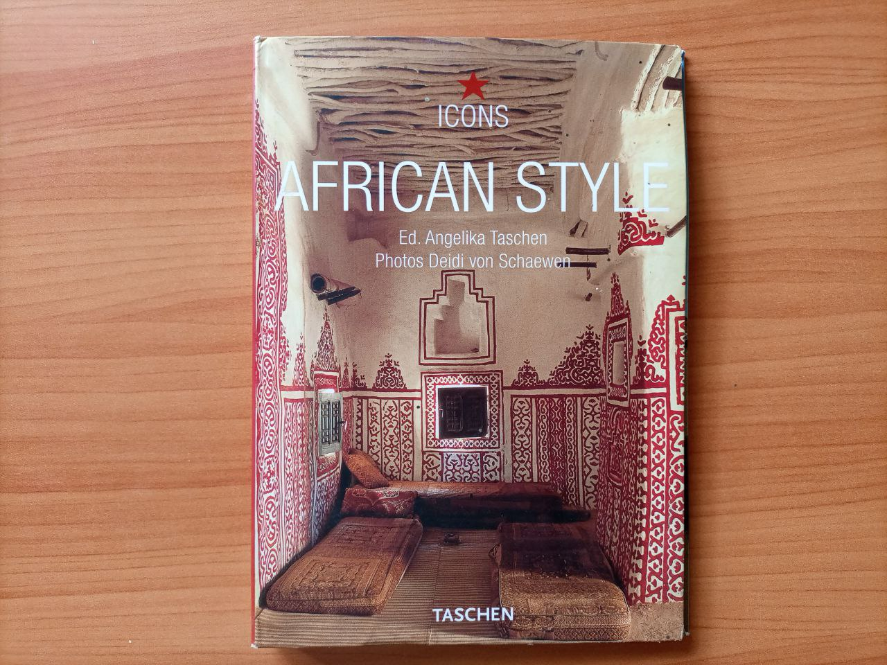

# **Tittle** PAGarchLibrary - Pagirinya Architecture Library
## PAG - stands for pagirinya
*Pagirinya* is a refugee camp in eastern adjumani district in northern Uganda.
## arch - stands for architecture
*architecture* is the art and technique of designing and building as distiquished from the skills associated with construction.

*library* - is a collection of resources in avarriety of formats.but for this case we are looking at the architectural format.

*Architecture library* is a learning lab for mult-disciplinary study of the built environment, providing hybrid collections of prints and digital materials
# objectives
- To provide adequate studies towards establishing an architecture that will shelter and cater for the needs of the internally displaced people,in this case the youths are trained with the resource on how to solve architectural problems in the local ways using the available resources.

  *Photo credit*:**Allan amanyara**
- To also provide a resource for architects with in and outside the camp to research and improve on their architectural knowledge.
- To reflect on stories about architecture and design of refugee camps, including urban designs,shelters,toilets and opinions about designs for the aid of camps.
# launch of PAGarchLibrary

  
   *Photo credit* **Allan amanyara**             

The initiative from R0g through #ASKnet to pagirinya satelite was launched on **19th/Feb/2022** at The Youth Empowerment Foundation (YEF),attended by over **50**people.
The diginitories present at the launch were the representative from UNHCR Mr vitali,the representative from R0g ,Mr Steven kovarts,local representatives,the RWC2 pagirinya refugee settlement,Mr obulejo martin, political leaders,the chairman LC3 dzapi subcounty,The DPC, pagirinya police station and students of pagirinya secondary school.
On behalf of **UNHCR Uganda**,Mr vitali applauded YEF and R0g(agency for open culture and critical transformation)for such innovative approach to eradicating community challenges.

 *Photo credit* **Allan amanyara**

He says the library will support the young refugees to be creative and develop their skills through reading architectural stories of other successful people in the industry and get inspirations from it.
He added that the project Will help in filling the knowledge gap since the young people can come together and develop ideas the world so desperately needs and contribute to the development of the community and UNHCR will try to lobby support for this kind of initiative.
He appealed the refugee Youths and host community to take advantage of the architectural library  to enhance their skills for employment and enterpreneurship.

 *Photo credit*: **Allan amanyara**

**Hon. Ondoga**,the Youthful Local council chairman of the Dzaipi sub-county in which Pagirinya refugee settlement is situated was one of the guests who graced the PAGarchLib launch. He too was amazed at the idea of creating such a unique library to inspire young people to be proactive in the community. He stated that for a community or a country to develop, it needs to have creative and impact-oriented young people. He rallied youth to make the best use of the library to gain the extra knowledge and inspiration that they would never get within the area. He appealed for the services to be open to the youth from the host community so that their talents are tapped for positive community impact and peaceful coexistence. He promised to cooperate with YEF for the necessary support to ensure the success of the project.

 *Photo credit*: **Allan amanyara**

The district police commander pagirinya police post was aldo present during the launch.

*Photo*:by **Allan amanyara**

**There are over 80+** Architecture, arts, and photography books  donated by Stephen Kovats and friends from Germany to help improve the architectural knowledge of the young people in the Pagirinya refugee settlement and beyond. The Library serves as a resource center for young people to access knowledge, get inspiration, ideas, and resources on architecture, art, photography, and media documentation.
For more check the book list in the link [list](books-list.md)

Some of the happiest moments during the launch of the Libray

  
 *Photo credit*:**Allan amanyara**

## Partners

| r0g Agency | ASKnet  | YEF |
| :--------: | :----: | :-------: |
|||   |
| [Official Website](https://openculture.agency/) | [Official Website](https://github.com/ASKnet-Open-Training) | [Official Website](https://yef-uganda.org/) |
